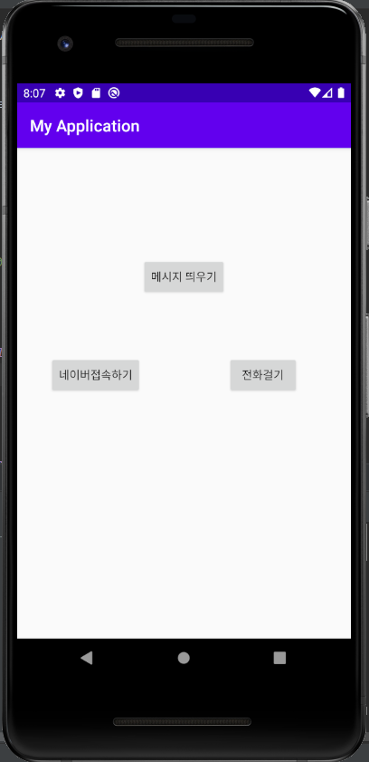
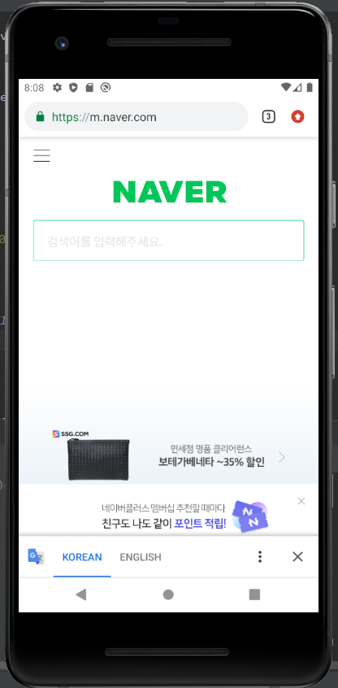
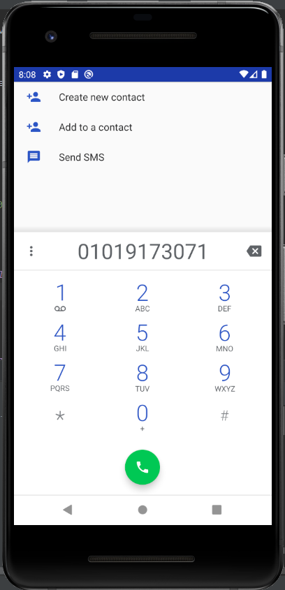

# 19173071 강미정

## 1주차 과제

## 2주차 과제
   </img>

## 3주차 과제
   </img>
   </img>
   </img>

## 4주차 과제
   - 여행에 관한 앱
   - 지금까지 수많은 여행에 관한 어플들이 생긴 것 같다. 좋은 여행지를 추천해 주는 것은 정말 좋지만 우리 같은 학생들이 여행을 가려면 돈이 부담되기도 한다. 그렇기 때문에 나는 원하는 금액을 설정하여 그에 알맞은 국내 여행지 코스를 추천해 줄 수 있는 어플을 만들고 싶다. 그 뿐만이 아니라 숨은 국내여행지 들을 서로 공유할 수 있는 공간도 만들어 여행을 좋아하는 사람들 간의 소통을 할 수 있도록 하는 공간도 만들고 싶다.
